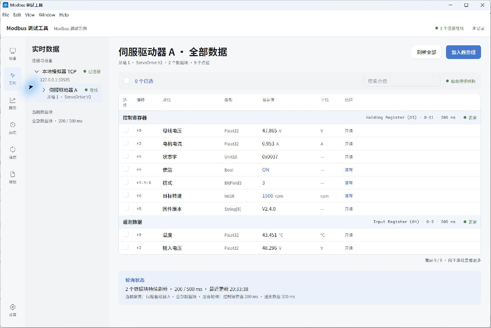
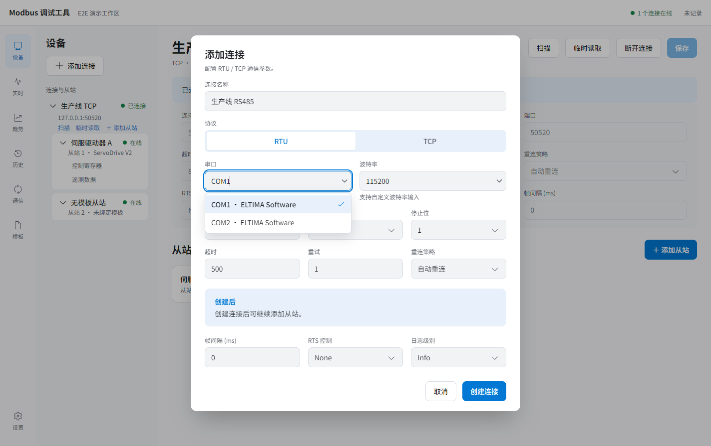
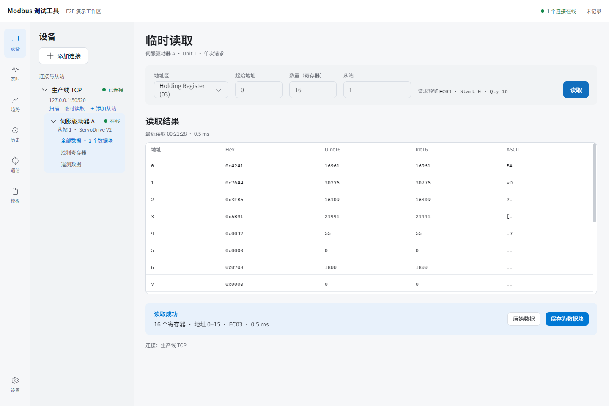
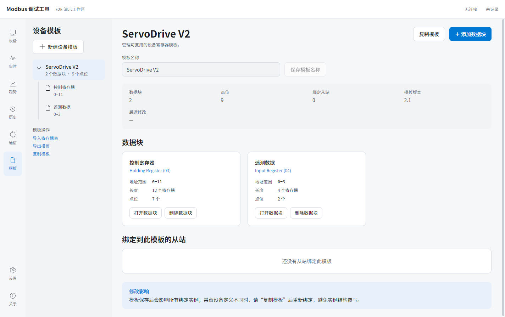
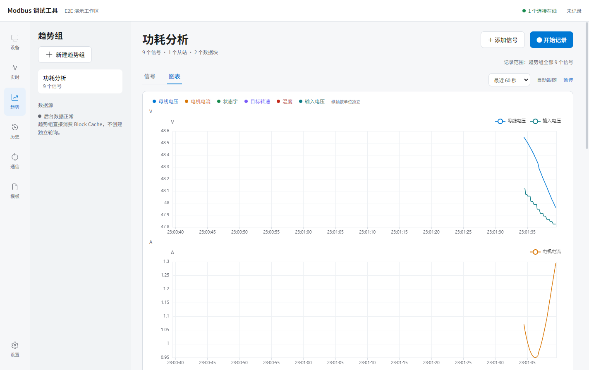
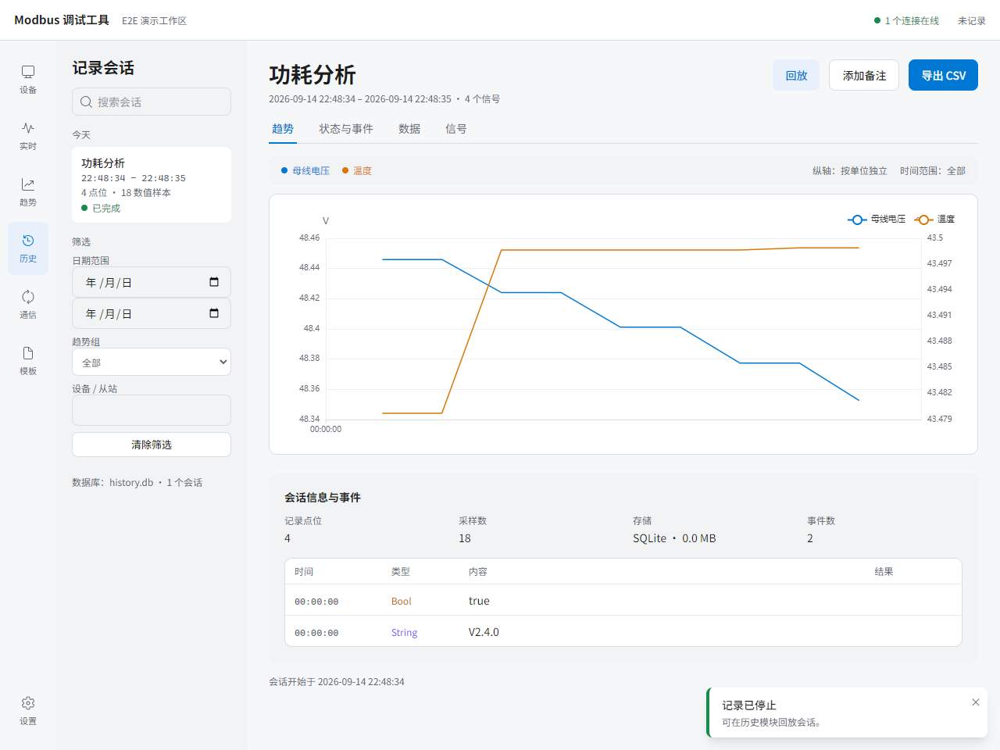
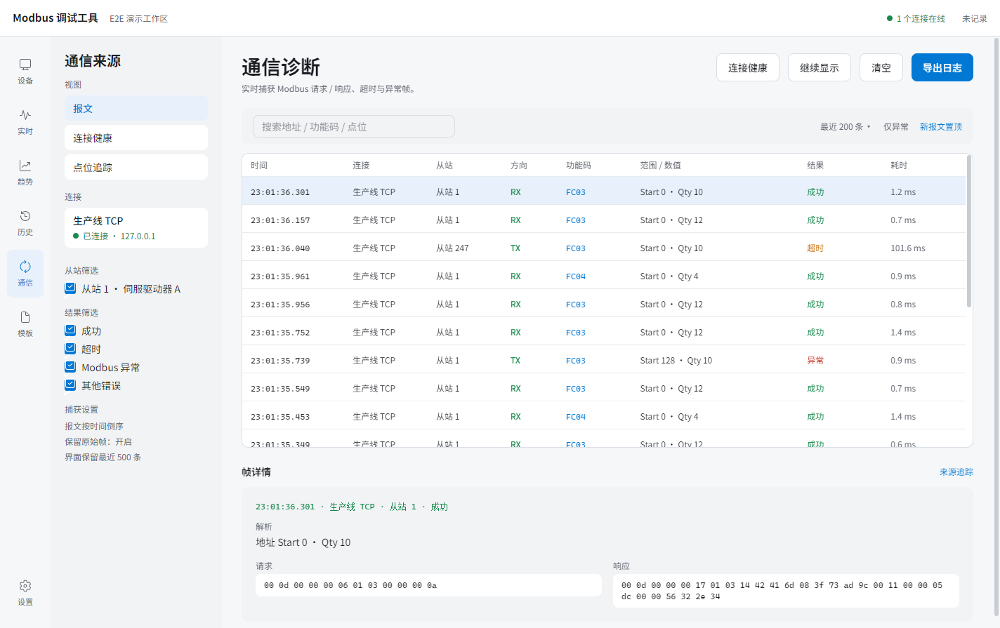
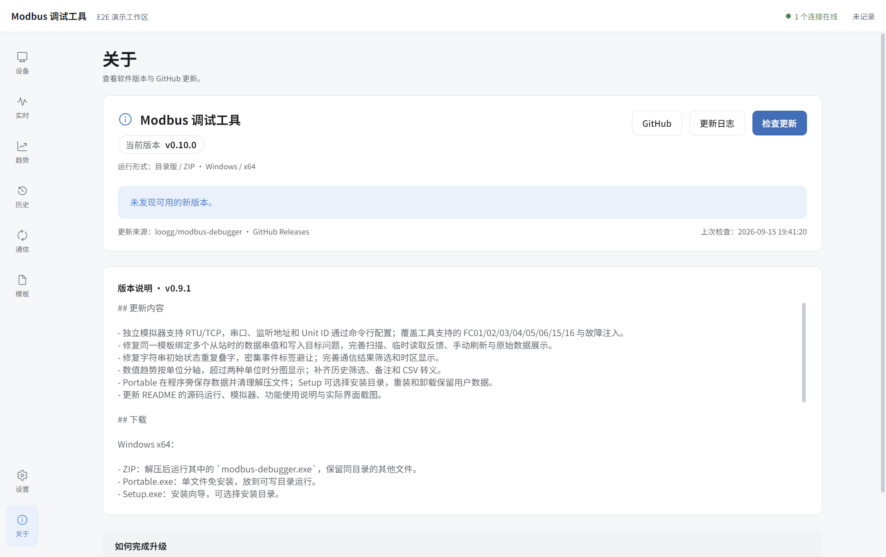

# Modbus Debugger

用于现场调试的 Modbus RTU / TCP 桌面工具。连接设备后，可以扫描从站、临时读取寄存器、配置点位、实时读写、观察趋势，并记录和回放历史数据。

[下载已发布版本](https://github.com/loogg/modbus-debugger/releases) · [下载最新构建](https://github.com/loogg/modbus-debugger/actions/workflows/windows-release.yml) · [反馈问题](https://github.com/loogg/modbus-debugger/issues)



*截图使用本地 PyModbus 模拟器和示例工作区，数据来自实际 TCP 通信。说明与当前主分支同步；已发布版本可能早于文档中的功能。*

当前提供 Windows x64 构建。直接使用软件不需要安装 Node.js 或 Python：

| 下载文件 | 使用方式 |
| --- | --- |
| `*-Portable.exe` | 单文件免安装，放到可写目录后运行 |
| `*.zip` | 解压后运行其中的 `modbus-debugger.exe`，保留同目录的其他文件 |
| `*-Setup.exe` | 运行安装向导，可选择安装目录；0.8.0 起使用 NSIS，卸载保留用户数据 |

最新分支构建位于 Actions 对应成功运行的 **Artifacts** 中，下载通常需要登录 GitHub，保留 14 天。版本标签发布的附件位于 Releases。

## 目录

- [一、从源码构建与运行](#一从源码构建与运行)
- [二、工具使用说明](#二工具使用说明)

## 一、从源码构建与运行

### 1. 准备环境

本文以 Windows x64 为例，使用 PowerShell 执行命令。

| 软件 | 用途 |
| --- | --- |
| Git | 获取源码 |
| Node.js 24.x（包含 npm） | 安装依赖、启动和打包；与 GitHub 构建环境一致 |
| Python 3.10+、PyModbus 3.15.0 | 可选，仅在使用本地模拟器或相关自动化测试时需要 |

### 2. 获取源码并启动

```powershell
git clone https://github.com/loogg/modbus-debugger.git
cd modbus-debugger
npm ci
npm start
```

`npm ci` 按锁文件安装依赖；首次安装需要联网下载依赖和 Electron。`npm start` 启动桌面窗口和开发服务器，修改前端代码时支持热更新。

### 3. 没有设备时，用模拟器体验

在一个终端中启动模拟器：

```powershell
python -m pip install -r tools/simulator/requirements.txt
npm run simulator -- --transport tcp --host 127.0.0.1 --port 50535 --units 1,2,3
```

保持该终端运行。模拟器提供 `127.0.0.1:50535` 上的 Unit 1、2、3，以及会变化的电压、电流、温度等数据。

也可通过虚拟串口对进行 RTU 联调。例如本机串口对为 COM1 ↔ COM2 时：

```powershell
npm run simulator -- --transport rtu --serial-port COM2 --baudrate 115200 --parity N --stopbits 1 --units 1,2,3
```

模拟器使用 COM2，上位机新建 RTU 连接使用 COM1，并设置为 115200 / 8N1。端口号只是示例，换机器时按实际配对修改；脚本不写死 COM 号，RTU 必须指定 `--serial-port`。下方示例工作区预设的是 TCP，RTU 联调需在软件中另建连接并绑定模板。

模拟器覆盖工具支持的 FC01/02/03/04/05/06/15/16，各 Unit 的数据独立。静态数据和超时、异常、延迟、坏 CRC 等故障注入参数见[模拟器说明](tools/simulator/README.md)。

本仓库提供可以直接打开的[示例工作区](docs/examples/demo.workspace.json)，其中已配置连接、从站、模板和趋势组。先复制一份，避免自动保存修改仓库中的示例：

```powershell
New-Item -ItemType Directory -Force data/workspaces | Out-Null
Copy-Item docs/examples/demo.workspace.json data/workspaces/demo.workspace.json
npm start
```

在软件中进入 **设置 → 导入工作区**，选择刚复制的 `data/workspaces/demo.workspace.json`。连接成功后进入 **实时**，再在左侧点击 **伺服驱动器 A**，即可看到持续变化的值。

> 模拟器只用于学习、截图和验证。连接真实设备时，请使用设备手册中的通信参数、Unit ID 和寄存器定义。

### 4. 打包为可分发的软件

```powershell
npm run make -- --platform=win32 --arch=x64
```

该命令已经包含程序构建，无需先执行 `npm run package`。完成后，`release/` 根目录直接包含：

```text
release/
├── modbus-debugger-<version>-win-x64/
├── modbus-debugger-<version>-win-x64.zip
├── modbus-debugger-<version>-win-x64-Portable.exe
└── modbus-debugger-<version>-win-x64-Setup.exe
```

版本号来自 `package.json`。新产物全部生成成功后才替换和清理旧版本；旧目录中的非程序文件会保留到 `release/data/backups/`。

只需要目录版进行本地验证时，可使用 `npm run package`，输出在 `out/`。测试、构建实现、目录结构和 GitHub 工作流见[开发说明](docs/development.md)。

## 二、工具使用说明

建议按下面的顺序开始：

**建立连接 → 扫描/临时读取 → 配置模板并绑定从站 → 实时读写 → 趋势与记录 → 历史回放**。

### 1. 建立 RTU 或 TCP 连接

1. 进入 **设备**，点击左侧 **添加连接**。
2. 输入名称，选择 RTU 或 TCP，并填写通信参数。
3. 创建后，在设备树中选择连接，查看连接状态；需要修改已连接的参数时，先点击 **断开连接**，修改并保存，再点击 **连接**。

| 类型 | 需要与设备一致的参数 |
| --- | --- |
| RTU | 串口、波特率、数据位、校验、停止位；串口下拉支持枚举，也可手工输入 |
| TCP | 设备/网关 IP 地址、端口；本地示例为 `127.0.0.1:50535` |



**“已连接”不等于从站已响应。** RTU 已连接表示串口已打开，TCP 已连接表示 Socket 已建立；具体从站和地址是否可用，还需要扫描或读取确认。

### 2. 扫描从站

在连接下点击 **扫描**，填写起始和结束 Unit，点击 **开始扫描**。

- 范围为 1–247，按 Unit ID 顺序探测。
- **高级扫描配置**默认折叠，可设置读取功能码、起始地址、超时和重试。
- 默认使用 FC03，从地址 0 读取 1 个寄存器，单次超时 150 ms，重试沿用连接设置。
- 功能码可选 FC01/02/03/04；读取数量固定为 1（位或寄存器）。
- 扫描期间当前连接的周期轮询暂停；点击 **停止扫描**后，当前请求收尾，不再探测后续地址，并恢复轮询。

进度中的“已检查 4/247、当前 Unit 5”表示前四个从站地址已检查完，**不是发现了四台设备**。发现数量单独显示，结果会陆续加入表格。正常响应和合法异常响应都算发现从站；可再用临时读取核对实际数据。

停止扫描会保留本次结果；重新开始会清空上次扫描结果。扫描不会自动把设备加入左侧列表，需要点击结果中的 **添加从站** 或使用左侧 **＋ 添加从站**。已添加的从站不受重新扫描影响。

### 3. 临时读取与失败排查

在连接下点击 **临时读取**，填写地址区、起始地址、数量和 Unit ID，确认请求预览后点击 **读取**。默认读取 FC03、地址 0、10 个寄存器。



临时读取是手工请求，不会自动建立周期轮询。读取成功后可以查看原始数值，并点击 **保存为数据块**，选择已有模板或新建模板继续配置。

失败时页面会显示原因、请求参数及可用的 Trace ID，点击 **查看通信诊断**可进一步核对报文：

| 提示 | 建议检查 |
| --- | --- |
| 超时 | Unit ID、串口参数/IP/端口、接线、设备是否支持本次功能码和地址；超时只表示未收到有效匹配的响应 |
| 异常 `0x01` | 设备是否支持该读取功能码 |
| 异常 `0x02` | 起始地址和读取范围是否存在，是否误用了 PLC 编号 |
| 异常 `0x03` | 请求参数是否符合设备要求 |
| 连接或传输失败 | 串口是否被占用/拔出、网络是否断开 |
| CRC、格式或响应不匹配 | 在通信诊断中检查原始帧、Unit ID、功能码及通信参数 |

读取期间会锁定输入和按钮。当前连接正在扫描时，请先停止扫描再临时读取；失败后不会把上次成功的数据当作本次结果展示。

### 4. 配置模板、数据块和点位

工具将通信连接与设备寄存器定义分开管理：

| 对象 | 表达的内容 |
| --- | --- |
| 连接 | 一条串口或 TCP 链路 |
| 从站 | 连接下的 Unit ID，以及绑定哪个设备模板 |
| 设备模板 | 可被多个从站复用的寄存器定义 |
| 数据块 | 地址区、起始地址、长度、轮询周期 |
| 点位 | 如何把数据块中的寄存器/位解释为电压、状态、转速等值 |

1. 进入 **模板**，新建设备模板，或选择已有模板点击 **编辑模板**。
2. 添加数据块，设置地址区、起始地址、长度和周期。同一模板、同一地址区的数据块不能重叠。
3. 添加点位，设置偏移、数据类型、寄存器数量、字节/字序、位宽、缩放和访问权限等。
4. 回到 **设备**添加或编辑从站，填写 Unit ID 并绑定模板。



点位允许共享寄存器，例如用一个完整状态字和多个 Bool/BitField 解释同一寄存器。模板修改会影响所有绑定的从站；设备定义不同时，应先复制模板再修改。

**核心地址统一为 0-based。** 例如 Holding Register 起始地址 0 表示 FC03 的协议地址 0，不能直接填 40001。PLC 风格地址只在导入寄存器表时转换。XLSX、CSV、JSON 或剪贴板导入应先完成字段映射与预览，再应用到模板。

### 5. 实时查看与写入

进入 **实时** 后，在左侧选择从站查看全部点位，或选择某个数据块聚焦查看。主界面预览中的表格会显示偏移、类型、当前值、单位及访问权限。

- 每个数据块按自己的周期刷新，切换页面不会停止后台轮询。
- 双击可写点位的当前值进入编辑，按 **Enter** 提交、**Esc** 取消。
- 输入值和写入中的待确认值不会冒充设备值；写入后读取确认，界面才更新为设备确认值。
- 写超时表示结果未知，不能直接认定失败或再次盲写，应观察回读及通信记录。
- 输入寄存器和离散输入只读；保持寄存器、线圈还要看点位的访问权限。

较窄窗口会在表格内横向滚动，不会隐藏关键工程列。点位配置了高风险写入确认时，提交前还会出现确认提示。

### 6. 观察趋势与开始记录

1. 进入 **趋势**创建趋势组并添加信号；已有趋势组时，也可在实时表选择关心的点位，点击 **加入趋势组**。
2. 在趋势组的 **信号**页管理信号，在 **图表**页观察曲线和状态变化。
3. 需要保存过程时，点击 **开始记录**；采集结束后点击 **停止记录**。



数值信号用折线，Bool 用数字波形，Enum 用状态段，String 用变化事件。图表显示/隐藏只影响展示，记录范围仍是趋势组的全部信号。趋势复用后台读取的数据，不会额外建立一套设备轮询。

**分轴依据是单位，不是信号个数。** 请在点位配置中一致填写单位，例如 `V`、`A`、`rpm`：

| 数值信号的单位种类 | 图表显示 |
| --- | --- |
| 1 种 | 多个信号共用一条纵轴 |
| 2 种 | 同一图表使用左右两条纵轴，同单位信号共用刻度 |
| 超过 2 种 | 按单位拆成多个图表，可上下滚动查看；每组保留该单位的全部信号 |

例如 12 个数值信号分属 4 种单位，会显示 4 个图表；未填写单位的数值信号归为同一组。Bool、Enum、String 显示在状态轨道中，不占用数值纵轴。

可选择最近 30 秒、60 秒或 5 分钟。**暂停**冻结当前显示窗口，**继续**在自动跟随开启时恢复追踪最新数据；关闭 **自动跟随**也可固定窗口。暂停显示不会停止设备轮询或正在进行的记录，停止保存需点击 **停止记录**。

String 轨道显示初始状态及后续变化。0.9.1 起，相同初始值与首条记录不会重复叠字；事件密集时会避让文字，长内容用省略号表示，悬停事件点可查看完整值。


> 不点击“开始记录”，实时数据不会默认长期保存。两次轮询之间发生并恢复的瞬态，也不保证被采集到。

### 7. 历史回放与通信诊断

**历史：**进入 **历史**，在左侧选择记录会话，查看趋势、数据及信号定义；点击 **回放**可离线查看变化过程。历史会话保留记录时的点位定义，后续修改模板不会改变旧会话的解释。



可按日期范围、趋势组和从站名称筛选左侧会话列表，点击 **清除筛选**恢复显示。**添加备注**可保存会话备注，保存后在状态与事件中查看。当前 **导出 CSV** 会把 CSV 文本复制到剪贴板，可粘贴到表格或文本文件中保存。

**通信：**进入 **通信**并选择连接，查看请求/响应事务，点击一行展开详细信息和原始报文。通过 **连接健康**查看请求率、耗时和错误统计；通过点位追踪检查事务来源。



侧栏 **结果筛选**可组合勾选：

| 筛选项 | 对应的事务结果 |
| --- | --- |
| 成功 | 收到有效的正常响应 |
| 超时 | 未在超时范围内收到有效匹配响应 |
| Modbus 异常 | 设备返回合法异常响应，例如 `0x02` 非法地址 |
| 其他错误（0.9.1 起） | CRC、格式、传输错误或意外响应等其他事务结果 |

结果筛选可与从站筛选、搜索组合使用；全部取消勾选时事务列表为空。**仅异常**会进一步排除成功事务，仍受侧栏筛选限制。下方的帧解析错误记录单独展示，不受事务结果筛选控制。

点击 **暂停**固定当前事务列表，**继续显示**恢复更新；设备通信仍会继续。**清空**清除内存诊断记录，**导出日志**将当前筛选的事务文本复制到剪贴板。

### 8. 保存工作区和管理文件

在 **设置 → 另存为** 保存 `.workspace.json`；确定文件位置后，配置修改会自动保存。**导入工作区**用于打开已有文件，**导出工作区**将 JSON 文本复制到剪贴板。

在 **设置 → 显示 → 时区**中选择跟随系统、UTC 或指定地区。绝对时间会按所选时区显示，例如同一报文的 UTC 时间为 08:00:00 时，在上海显示为 16:00:00；存储的 UTC 时间戳不变。历史回放轴和状态轨道上的 `00:00:00` 表示从会话开始计算的相对时长，不随时区改变。

默认存储根目录是程序所在目录；Portable 使用外层 EXE 所在目录，源码开发模式使用项目目录：

```text
程序目录/
├── data/
│   ├── prefs.json        # 窗口、语言、时区等偏好
│   ├── history.db        # 历史数据库
│   └── workspaces/       # 保存对话框的默认位置
├── cache/                # 浏览器缓存
├── logs/main.log         # 运行日志
└── temp/                 # 临时文件与 Portable 解压目录
```

也可指定另一处可写目录：

```powershell
.\modbus-debugger.exe --data-dir="D:\ModbusData"
```

或设置 `MODBUS_DATA_DIR` 环境变量，命令行参数优先。目录不可写时会提示并退出，不会悄悄改写到 AppData。程序或所选目录在 C 盘时，相关文件自然仍在 C 盘；Windows 安装器的注册表、快捷方式等系统机制不受这一约定限制。

0.8.0 起使用新的目录布局，不自动覆盖或删除旧 AppData 文件。需要的旧工作区可手动打开；设置页可查看当前历史数据库路径。

### 9. 关于与检查更新

0.10.0 起，左侧底部的 **关于** 显示当前软件版本、架构和运行形式：



1. 点击 **检查更新**，获取本项目 GitHub Releases 的最新正式版本，不会使用 Actions 构建或自动降级。
2. 发现新版本后，可阅读版本说明，点击 **下载 v…**。安装版下载 Setup、Portable 下载 Portable、目录版/ZIP 下载 ZIP，均匹配当前架构。
3. 下载进度实时显示，可取消；切换页面不会中断下载。网络失败、GitHub 限流、缺少匹配附件或校验失败会显示原因，可重新检查或下载。
4. 提示 SHA-256 校验通过后，点击 **打开下载目录**。先保存工作区、结束记录并关闭软件，再运行 Setup 或替换/解压新程序；保留原有 `data/`、`cache/`、`logs/`、`temp/` 用户目录。

完整更新包保存在当前数据根目录的 `data/updates/`，未完成文件在 `temp/updates/`。此功能手动触发检查和下载；下载完成后仍需按提示完成升级。

0.9.x 及更早版本没有“关于”入口，需要先从[GitHub Releases](https://github.com/loogg/modbus-debugger/releases)手动获取包含此功能的版本。

### 10. 常见问题

| 问题 | 处理方式 |
| --- | --- |
| 已连接，但没有从站数据 | 先用扫描或临时读取验证 Unit ID；再确认从站已启用并绑定包含数据块/点位的模板 |
| 进入实时页面后是空的 | 在左侧选择从站或数据块 |
| 读到数值但明显不对 | 核对数据类型、字节/字序、偏移、寄存器数量及缩放参数 |
| 修改模板影响了另一台设备 | 两个从站可能绑定了同一模板；设备定义不同请复制模板 |
| 历史列表为空 | 先在趋势组开始并停止一次记录，确认设置页显示的是预期数据库 |
| 修改时区后回放的 `00:00:00` 没变化 | 这是会话相对时长；会话开始时间、报文时间等绝对时间才随时区转换 |
| 多个信号没有共用纵轴 | 检查点位的单位字段是否一致；超过两种单位会分图显示 |
| 下载的版本与截图不同 | README 与主分支同步；查看下载版本号，需要新功能时获取最新成功 Actions 构建 |

提交问题时，请附上版本号、RTU/TCP 类型、复现步骤、异常提示和必要的通信记录；可先移除设备地址、名称等不希望公开的信息。

开发实现与验证命令：[开发说明](docs/development.md) · [架构](docs/architecture.md) · [协议说明](docs/protocol/01-application-protocol.md)。
