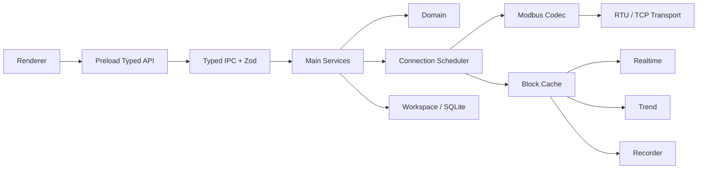

### Runtime

### Modbus Client Core

- `domain/protocol` 自研纯 TypeScript PDU / RTU / TCP Codec 与 request/result model。
- 正式范围：FC01 / 02 / 03 / 04 / 05 / 06 / 15 / 16。
- 接收路径分层为 `Transport → Streaming Framer / Parser → ADU Validator → PDU Decoder`；Transport 只交付任意 byte chunk，不承担“一次 read/recv = 一帧”的假设。
- **TCP Framer**：基于 MBAP Header 的 Protocol ID / Length 等字段判断候选帧长度；不足一帧继续缓存，完整后逐帧 emit，并继续解析同一 buffer 中后续帧。非法 MBAP / Length 必须触发受控 Resync，不能无条件 `buffer.clear()`。
- **RTU Framer**：结合串行接收状态、当前请求的预期响应形态/长度与 RTU 时序边界完成分帧；协议语义上帧内超过 t1.5 的字符间隔视为不完整帧，帧间至少 t3.5 的静默用于建立新帧边界。实现可以组合 request-context 长度判断与定时器，但不得忽略这两个边界语义。CRC 和 PDU 长度/功能码组合用于完整帧校验；截断、CRC 错或噪声后必须在下一可信边界恢复。
- 标准尺寸边界固定为 PDU ≤ 253 bytes、RTU ADU ≤ 256 bytes、TCP ADU ≤ 260 bytes；TCP / RTU 的 buffer 上限和异常等待边界必须围绕这些协议上限设计，超长 Length、连续垃圾数据或永远不完整的候选帧不能导致无限等待或内存增长。
- 合法 Exception Response 单独归类，不得误判为 malformed frame；结构合法但与当前 in-flight request 不匹配的响应归为 `Unexpected Response`。协议结果至少区分 `OK / Exception Response / Unexpected Response / Timeout / CRC Error / Malformed Frame / Transport Error`。
- TCP 使用 MBAP Transaction ID 做线上请求关联，但它与应用 `traceId` 分离；迟到的旧响应可依据 Transaction ID 识别并丢弃/记录，不得关联到后续请求。
- RTU 没有 Transaction ID。发生 Timeout、截断帧或严重帧错误后，Connection Runtime 必须进入**有界 drain / quiet recovery**：在确认串口接收重新达到可信静默边界前，不把迟到字节关联到下一请求；恢复完成后再继续调度。即使 Unit ID / Function 相同，也不得仅凭字段相似把 Timeout 后迟到的旧响应当作新请求响应。
- 对当前请求已知的 Unit ID、Function Code、预期响应形态/长度要作为 Framing 与匹配上下文，减少噪声或旧响应被误接受的风险。
- Framer / Validator 不得静默吞掉协议异常：至少输出结构化 parse/error event，记录错误类型、原因、相关 Raw Bytes、Resync 丢弃字节数/范围以及关联的 connection/request context；诊断层据此生成 Transaction / communication diagnostic 记录。

### Connection Scheduler

- 每 Connection 独立 Runtime / Scheduler，当前 RTU / TCP 均 `maxInFlight = 1`。
- 优先级：写确认序列 → Temporary Read / 手工诊断 → Periodic Poll。
- RTU Scanner 独占该 Connection；扫描期间暂停 Poll，结束后恢复。
- `Write → Read Back` 不可被 Poll 插入；部分寄存器 `Read latest → Mask/Merge → Write → Read Back` 是原子调度组；Write Timeout 后 Read Back 仍属于同一确认序列。
- 周期、Timeout、latency 使用 monotonic clock；展示/持久化同时保存 UTC wall-clock timestamp。

### Transaction

每个事务至少记录 `traceId`、connectionId、unitId、functionCode、sourceKind/sourceId、UTC start、monotonic duration、Raw ADU/PDU、result、Exception Code；TCP 另存 `mbapTransactionId`。

### Simulator / Fixtures

- Unit / Integration 使用 Fake Modbus Transport，除 response、delay、timeout、exception、disconnect 外，还必须能够按任意 chunk 边界交付接收字节，以制造半包、粘包、混合切分、噪声和坏帧后正常帧。
- `tests/fixtures/protocol/` 保存独立 Golden RTU/TCP request / response / exception / CRC vectors，expected bytes 禁止由被测 Codec 生成。
- Streaming Parser Fixtures 必须覆盖合法帧的多种切分方式，以及 malformed frame 后紧跟合法帧的恢复序列。
- Standalone Simulator 优先 Python PyModbus，与正式 TypeScript Client 独立；TCP Simulator 必须进入 E2E。
- Windows 无稳定虚拟 COM 时，RTU 自动回归以 Golden + Fake Transport + serialport Mock 为硬门槛，同时保留真实/虚拟串口 Smoke Test。

### Responsive

- 设计基准 1440×960；最小 1024×680；Standard ≥1280，Compact 1024–1279。
- App Rail 72px；Sidebar 默认 244px，可调 220–320px 并持久化。
- Table 工程列不因窄窗口隐藏；达到最小列宽后内部横向滚动；Header 保持 Sticky，Point 列 Pin 在左侧保持可见；Drawer Overlay Main；Dialog Body 内滚动。