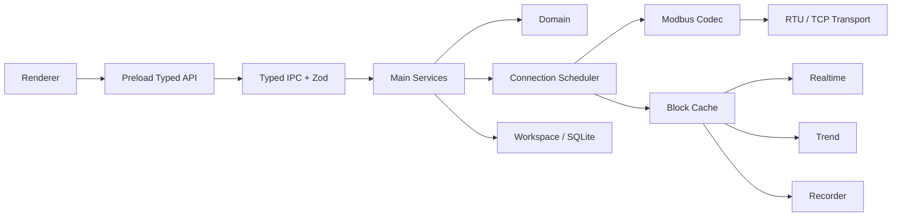

### Runtime

### Modbus Client Core

- `domain/protocol` 自研纯 TypeScript PDU / RTU / TCP Codec 与 request/result model。
- 正式范围：FC01 / 02 / 03 / 04 / 05 / 06 / 15 / 16。
- 接收路径分层为 `Transport → Streaming Framer / Parser → ADU Validator → PDU Decoder`；Transport 只交付任意 byte chunk，不承担“一次 read/recv = 一帧”的假设。
- **TCP Framer**：基于 MBAP Header 的 Protocol ID / Length 等字段判断候选帧长度；不足一帧继续缓存，完整后逐帧 emit，并继续解析同一 buffer 中后续帧。非法 MBAP / Length 必须触发受控 Resync，不能无条件 `buffer.clear()`。
- **RTU Framer（不依赖字符间隔时序）**：本实现**不使用 t1.5 / t3.5 作为分帧判决，也不作为诊断 hint**，且不保留任何 strict/时序模式开关。理由：USB 串口驱动与操作系统调度会把字符间隔拉伸到远超协议值，以间隔判帧会在真实链路上产生大量假“不完整帧”。分帧依据固定为四条：
   1. **预期长度优先**：结合当前 in-flight 请求的预期响应长度（Unit ID + FC + 响应形态）切帧，天然处理半包/粘包混合；
   2. **可信边界扫描**：无请求上下文时在缓冲中扫描第一个 CRC 自洽的帧，扫描起点之前的字节按噪声/坏帧丢弃并记录 Resync 范围；
   3. **CRC + PDU 长度/功能码校验**：候选帧校验失败记 `crc` / `malformed`，并在候选内继续扫描被粘连的合法帧；
   4. **有界等待**：候选帧长期不完整受 `incompleteTimeoutMs` 与接收缓冲上限约束，记 `truncated` / `overflow`，不会无限等待或无限增长。
- 标准尺寸边界固定为 PDU ≤ 253 bytes、RTU ADU ≤ 256 bytes、TCP ADU ≤ 260 bytes；TCP / RTU 的 buffer 上限和异常等待边界必须围绕这些协议上限设计，超长 Length、连续垃圾数据或永远不完整的候选帧不能导致无限等待或内存增长。
- 合法 Exception Response 单独归类，不得误判为 malformed frame；结构合法但与当前 in-flight request 不匹配的响应归为 `Unexpected Response`。协议结果至少区分 `OK / Exception Response / Unexpected Response / Timeout / CRC Error / Malformed Frame / Transport Error`。
- TCP 使用 MBAP Transaction ID 做线上请求关联，但它与应用 `traceId` 分离；迟到的旧响应可依据 Transaction ID 识别并丢弃/记录，不得关联到后续请求。
- RTU 没有 Transaction ID。发生 Timeout、截断帧或严重帧错误后，Connection Runtime 必须进入**有界 drain / quiet recovery**：在确认串口接收重新达到可信静默边界前，不把迟到字节关联到下一请求；恢复完成后再继续调度。即使 Unit ID / Function 相同，也不得仅凭字段相似把 Timeout 后迟到的旧响应当作新请求响应。
- 对当前请求已知的 Unit ID、Function Code、预期响应形态/长度要作为 Framing 与匹配上下文，减少噪声或旧响应被误接受的风险。
- Framer / Validator 不得静默吞掉协议异常：至少输出结构化 parse/error event，记录错误类型、原因、相关 Raw Bytes、Resync 丢弃字节数/范围以及关联的 connection/request context；诊断层据此生成 Transaction / communication diagnostic 记录。

### Connection Scheduler

- 每 Connection 独立 Runtime / Scheduler，当前 RTU / TCP 均 `maxInFlight = 1`。
- 优先级：写确认序列 → Temporary Read / 手工诊断 → Periodic Poll。
- RTU Scanner 独占该 Connection；扫描期间暂停 Poll，结束后恢复。
- `Write → Read Back` 不可被 Poll 插入；部分寄存器 `Read latest → Mask/Merge → Write → Read Back` 是原子调度组；Write Timeout 后 Read Back 仍属于同一确认序列。
- 周期、Timeout、latency 使用 monotonic clock；展示/持久化同时保存 UTC wall-clock timestamp。
- 连接生命周期：`connection.connect` / `connection.disconnect` 记录**用户意图**（RuntimeManager.userOffline）。配置编辑会重建 ConnectionRuntime，重建时保留该意图：显式断开后保存不会自动重连，必须再次点击「连接」；应用启动时意图集合为空，按原有行为自动建立链路。
- 设置页锁定：连接处于 online / connecting 时参数表单整体禁用（含串口/波特率下拉），避免运行中改参数撕裂传输；断开后可编辑，保存后仍保持离线直到用户连接。扫描 / 临时读取同样要求连接状态。

### Transaction

每个事务至少记录 `traceId`、connectionId、unitId、functionCode、sourceKind/sourceId、UTC start、monotonic duration、Raw ADU/PDU、result、Exception Code；TCP 另存 `mbapTransactionId`。

### Simulator / Fixtures

- Unit / Integration 使用 Fake Modbus Transport，除 response、delay、timeout、exception、disconnect 外，还必须能够按任意 chunk 边界交付接收字节，以制造半包、粘包、混合切分、噪声和坏帧后正常帧。
- `tests/fixtures/protocol/` 保存独立 Golden RTU/TCP request / response / exception / CRC vectors，expected bytes 禁止由被测 Codec 生成。
- Streaming Parser Fixtures 必须覆盖合法帧的多种切分方式，以及 malformed frame 后紧跟合法帧的恢复序列。
- Standalone Simulator 优先 Python PyModbus，与正式 TypeScript Client 独立；TCP Simulator 必须进入 E2E。
- Windows 无稳定虚拟 COM 时，RTU 自动回归以 Golden + Fake Transport + serialport Mock 为硬门槛，同时保留真实/虚拟串口 Smoke Test。

### 构建与打包（Vite）

- 构建插件：`@electron-forge/plugin-vite`（forge 7.x）。三份配置分别对应三个 target：
  - `vite.main.config.ts`：Main 进程，CJS 输出到 `.vite/build/index.js`；`sql.js` / `serialport` / `@serialport/*` 声明为 external（原生或 UMD 模块不能进 bundle）。
  - `vite.preload.config.ts`：Preload，固定输出文件名 `.vite/build/preload.js`（Main 以 `path.join(__dirname, 'preload.js')` 加载）。
  - `vite.renderer.config.ts`：Renderer，入口为**仓库根** `index.html`，输出 `.vite/renderer/main_window/`，单文件 IIFE bundle（避免 app:// 下的 chunk 瀑布与 sandbox 内动态 import 边界问题）。
- `package.json` 的 `main` 指向 `.vite/build/index.js`。
- 生产渲染层通过特权自定义 scheme 提供：`protocol.registerSchemesAsPrivileged([{ scheme: 'app', privileges: { standard: true, secure: true, supportFetchAPI: true, corsEnabled: true } }])` + `protocol.handle('app', ...)` → `net.fetch(pathToFileURL(...))`，窗口 `loadURL('app://./index.html')`。这样既避开 `file://` 下 ES module 的 CORS 限制，又不需要关闭 webSecurity；handler 只注册一次（macOS `activate` 会再次调用 `createWindow`）。
- 开发模式使用 forge 注入的 `MAIN_WINDOW_VITE_DEV_SERVER_URL`；类型声明见 `src/main/vite-env.d.ts`。
- 打包：plugin-vite 会让 packager 跳过 `node_modules`，因此 `packageAfterCopy` 钩子显式复制 external 依赖（`sql.js`、`serialport`、`@serialport`、`debug`、`ms`、`node-gyp-build`、`node-addon-api`）进 asar；`AutoUnpackNativesPlugin` 负责把 `.node` 二进制 unpack。
- Main 中禁止对被 bundle 的依赖使用裸 `require()`（rollup 会原样保留成运行时 require，而包里没有对应 `node_modules`）；只有 external 依赖（`serialport`、`sql.js`）可以保留运行时 require。`electron-squirrel-startup` 必须以 ESM import 引入，让它进 bundle。

### Snapshot / Delta 与渲染性能

Main 以 100 ms tick 驱动 Scheduler，但**只有真正变化的切片才进 delta**，Renderer 侧按切片订阅：

- `collectDelta()` 的每 tick 成本必须是 O(变化量)，不是 O(全量)：
  - 事务 / 帧事件使用 DiagnosticsStore 的**绝对游标**（`transactionTotal` / `parseEventTotal` + `transactionsSince(from)`），不再每 tick 复制整个 5000 条环形缓冲；环形缓冲写满后游标语义依然正确（按长度比较会在满环后彻底停止推送）。
  - `buildSnapshot()` 会把游标对齐到当前 total，因此快照里已含的记录不会被随后的 delta 重复推送。
  - 连接视图的“最后成功响应时间”由 `recordTransaction` 增量维护（`lastOkUtcFor`，O(1) 读），不再每 tick 过滤整环。
  - 点位索引 `pointIndex()` 按 `WorkspaceService.revision` 缓存；工作区对象每次编辑整体替换，因此 revision 是安全失效键。
  - 连接健康 `healthFor()` 每连接最多 1 Hz 重算（`healthForCached`），delta 只在缓存代次变化时推送；告警检查 5 s 一次。
  - 每次健康重算会记录一个 `HealthSample`（1 Hz，环形 600 点 = 10 min），供“连接健康”页 5 分钟曲线通过 `diagnostics.healthSeries` 命令拉取；曲线是真实测量值，不是占位数据。
- `diagnostics.clear` 递增 `diagRev`，Renderer 收到后清空本地事务 / 帧事件副本（delta 只能追加，无法表达“清空”）。
- `prefs` / `dirty` / `warnings` 由 Main 权威维护，且**不随 workspace revision 变化**，因此各自带独立变更追踪（`WorkspaceService.prefsRevision`、`sentDirty`、`warningsDirty`），变化时进 delta；`buildSnapshot()` 把三个追踪器对齐到快照已携带的值。此前它们只出现在初始快照里：设置页改时区/语言后 prefs.json 已写但 Renderer 永远收不到新值，界面不变。
- Renderer `applyDelta` 必须在事务分支的 early return **之前**应用 prefs：轮询期间 `prefs.set` 产生的 delta 经常与新事务同批到达，若先走事务分支 return，prefs 会被静默丢弃。回归测试：`tests/unit/store-prefs.test.ts`、`tests/integration/manager-delta.test.ts`（含“轮询洪水中的 prefs delta”与“不每 tick 重发 prefs”用例）。
- Renderer 订阅规则（强制）：
  - 根组件 `App` 只订阅 `useSnapshotReady()`。订阅整个 `snapshot` 会让每次 delta 重渲染整棵树，并使下层所有窄选择器失效。
  - 组件使用 `store/app.ts` 导出的切片 hook（`useWorkspace` / `usePoints` / `useBlocks` / `useConnectionStates` / `useTransactions` / `useHealth` / `useSessions` / `useRecording` / `usePrefs` …）或返回原始值的选择器；`applyDelta` 对未携带的切片保留原引用，因此 Object.is 比较可以让组件跳过重渲染。
  - 表格行必须可 memo：`DataTable` 的行组件按 row 身份 + columns 身份比较，调用方的 `columns` 必须用 `useMemo` 保持身份稳定；`onRowClick` 由内部 ref 转成稳定回调。
  - 实时表的行组件按**实际绘制的原始值**（engText / rawText / enumLabel / …）比较，因为一次轮询会为整块生成新的 view 对象；虚拟列表的定位放在外层 wrapper，滚动不会打穿行 memo。
  - 趋势缓冲 `live` 就地 push + 前端裁剪（5000 点 / 2000 事件）；此前每个 delta 对每个点位做一次 5000 元素数组复制，是渲染端最大热点。
  - ECharts `setOption` 合并到最多 4 Hz（250 ms）。
- Hook 顺序：所有 Hook 必须位于任何 early return 之前。`react-hooks/rules-of-hooks` 已设为 error —— 条件 Hook 会让 React 抛错并卸载整棵树，表现为窗口白屏。

### 显示时区与多语言

- 所有时间戳以 UTC（ISO-8601）存储与传输；**渲染统一走 `src/renderer/time.ts`**（Intl.DateTimeFormat + 配置时区）。组件内禁止直接 `iso.slice(11, 23)`（UTC）或 `Date#toTimeString()`（OS 本地）混用——侧栏本地时间 vs 表头 UTC 差 8 小时正是这类混用造成的。
- 时区偏好存于 `prefs.timezone`（`local` 跟随系统，或 IANA 名称），设置页可切换；侧栏会话列表、详情页表头、报文表、图表轴与 tooltip 共用同一格式化器，因此同一会话在各处显示一致。非法时区串回退到系统时区。
- 历史回放的时间轴是**会话内偏移**（`tMs`），不是墙钟：`NumericChart` / `StateTrack` 通过 `xMode="duration"` 用 `fmtDuration` / `fmtDurationMs` 渲染（`00:00:01` 形式），与事件表、回放游标保持一致；实时趋势仍为 `xMode="epoch"`（墙钟，走显示时区）。此前历史图把 `tMs` 当 epoch 渲染，轴上出现 `08:00:00`（epoch 0 + UTC+8）这类无意义刻度。
- 多语言技术栈：**i18next（核心：插值/复数/回退/词典懒加载）+ react-i18next（绑定）**。词典是类型化 TS 模块（`src/renderer/i18n/locales/<lang>/<area>.ts`，按界面区域分片），通过 i18next 的 `CustomTypeOptions` 声明资源类型，**缺失 key 在编译期报错**；当前仅接入 zh-CN，新增语言 = 新增同形状词典并在 `src/renderer/i18n/index.ts` 注册 + 在 `LANGUAGE_OPTIONS` 暴露。语言偏好存于 `prefs.language`，快照 prefs 变化时 `changeLanguage`。

### 下拉框（ComboInput）真实鼠标语义

- ComboInput 的选项节点在选中时同步卸载；真实鼠标点击下 Chrome 会在此之后向 input 补发一个**重定向的第二个 click**（合成 `el.click()` 不会产生该事件）。输入框的「点击重开」逻辑会因此立刻重开刚关闭的列表，表现为「选中后下拉不消失，必须点别处」。修复：选中时记录 200 ms 重开抑制窗口，窗口内 input 的 onFocus/onClick 不重开；窗口过后点击输入框仍可重开。
- blur 宽限期（120 ms）只在焦点移到组合框**外部**时排程关闭：`relatedTarget` 落在自身 chevron 上视为未离开，否则「输入框有焦点时点 chevron 展开」会在展开后 120 ms 被宽限期关掉；chevron 的展开分支同时清除未到期的关闭定时器。
- Radix Select 在 pointerdown 打开，因此 E2E 对一切下拉交互（Radix 与 ComboInput）一律使用真实 WDIO 鼠标点击，禁止页内合成 click——合成点击无法覆盖上述重定向行为。回归：添加连接串口/波特率真实点击断言 + 组件测试 retarget 用例。

### Responsive

- 设计基准 1440×960；最小 1024×680；Standard ≥1280，Compact 1024–1279。
- App Rail 72px；Sidebar 默认 244px，可调 220–320px 并持久化。
- Table 工程列不因窄窗口隐藏；达到最小列宽后内部横向滚动；Header 保持 Sticky，Point 列 Pin 在左侧保持可见；Drawer Overlay Main；Dialog Body 内滚动。

### Override：历史存储使用 sql.js 替代 better-sqlite3

- 证据：better-sqlite3 为 V8-API 原生模块，ABI 敏感。Node 与 Electron 之间切换需重编译或切换 prebuild；缺少 ClangCL 工具链的机器源码编译直接失败（本机复现：MSB8020）；多机器开发与分发无法保证 npm install 零编译。
- 决定：history.db 改由 sql.js（MIT，SQLite 的 WASM 构建）承载，零原生二进制；落盘文件仍为标准 SQLite 数据库（sql.js export 字节），外部工具可直接打开；写入采用事务 + 去抖原子落盘（临时文件 + rename）。
- 保留：serialport（N-API prebuilds，ABI 稳定，Node/Electron 通用）。
- 影响面：仅 src/main/services/history.ts 与其调用方（main 启动、持久化测试）；对外 API 不变。
- Vite 相关：`sql.js` 在 `vite.main.config.ts` 中声明为 external（其 UMD 产物被 Vite 打包后会以 `Cannot set properties of undefined (setting 'exports')` 失败），由 forge `packageAfterCopy` 钩子复制进包；`sql-wasm.wasm` 通过 `createRequire(...).resolve('sql.js')` 的同目录解析定位，开发模式、打包版与 Vitest 三种布局都可用。
- 该 Override 同时消除了 ABI 敏感原生模块：项目不再需要 `electron-rebuild` / prebuild 切换流程（`serialport` 走 N-API prebuilds，Node / Electron 通用）。

### 重试与日志级别语义

- 重试策略（Connection Scheduler）：
  - 读类请求（周期轮询 / 临时读取 / 扫描 / 回读 / RMW 读）：仅在 `timeout` 或 `transport`（请求未发出）时按 `connection.retries` 追加尝试，退避 50 ms；`exception` 不重试（设备已明确拒绝）。
  - 写请求：`timeout` / `crc` 类失败不重试（写可能已生效，盲重试会双重写入；由强制 Read Back 判定真实状态）；仅 `transport`（未发出）时重试。
  - 收到合法 Exception Response **立即结算**，不再等到超时；坏帧 / 不匹配帧仍按超时路径处理。
- 超时取值：`attemptRequest` 使用 `opts.timeoutMs ?? connection.timeoutMs`，即**连接配置的超时对轮询 / 临时读取 / RMW / 写 / 回读全部生效**；只有 Unit Scanner 显式传入更短的探测超时（默认 150 ms）。
- 日志级别（连接级 logLevel）：
  - info：事务仅记录到应用内通信诊断（UI）。
  - debug：额外将每次 TX/RX 原始 ADU hex、Validator 判决、重试决策写入 electron-log（落盘位置见下节：执行目录 `logs/main.log`）。

### 日志与数据落盘位置（不使用系统盘）

- 运行日志：<执行目录>/logs/main.log（打包版为 exe 所在目录；开发模式为项目目录）。执行目录不可写时禁用文件日志并告警，不回退到 %APPDATA%。
- 历史数据库：默认 <执行目录>/data/history.db，可在设置中改到任意路径（prefs.historyDbPath）；设置页显示真实生效路径。
- 工作区文件：用户显式选择的路径；自动保存为临时文件 + 原子替换。

### 退出资源释放

- before-quit 拦截退出 → await RuntimeManager.stop()：停止所有 Scheduler 定时器、结算 in-flight 请求、关闭串口（serialport.close）与 TCP socket、flush 并关闭 history.db、flush 工作区 → 然后 app.exit(0)。
- 异常崩溃时由操作系统回收句柄；正常关闭路径保证优雅释放（集成测试覆盖 stop() 后 transport.connected === false）。
