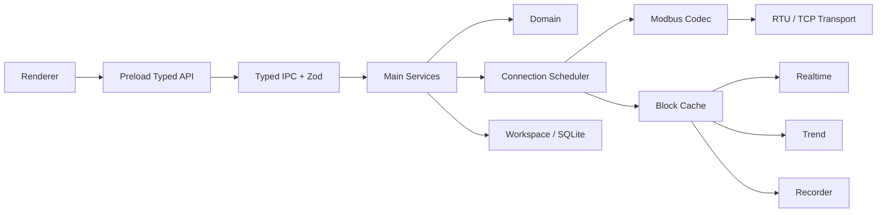

# 当前架构

本文件记录现行实现契约；产品语义见 [project-spec.md](project-spec.md)，历史故障与验证过程见 [full-audit.md](full-audit.md)。

## Runtime

## 跨进程契约与工作区编辑

- `src/shared/contracts.ts`、`commands.ts` 和 `snapshot.ts` 定义跨 Main / Preload / Renderer 的类型与命令；Main 内部类型不得被 Renderer 或 Shared 反向引用，ESLint 对此设边界检查。
- 连接、从站、模板、数据块、点位和趋势编辑通过细粒度命令进入 Main。`mutateWorkspace()` 基于 Main 当前 Workspace 生成并验证新状态；生产界面不提交完整 Workspace。`workspace.apply` 只保留给隔离的测试 fixture 和内部工具，正式打包的 IPC 默认拒绝此命令。
- 工作区变更发布 Snapshot / delta；连接配置替换须等旧传输关闭后才启动新传输。历史记录、Block Cache 与 Scheduler 仍由 Main 统一维护。

## Modbus Client Core

- `domain/protocol` 自研纯 TypeScript PDU / RTU / TCP Codec 与 request/result model。
- 正式范围：FC01 / 02 / 03 / 04 / 05 / 06 / 15 / 16。
- 接收路径分层为 `Transport → Streaming Framer / Parser → ADU Validator → PDU Decoder`；Transport 只交付任意 byte chunk，不承担“一次 read/recv = 一帧”的假设。
- **TCP Framer**：基于 MBAP Header 的 Protocol ID / Length 等字段判断候选帧长度；不足一帧继续缓存，完整后逐帧 emit，并继续解析同一 buffer 中后续帧。非法 MBAP / Length 必须触发受控 Resync，不能无条件 `buffer.clear()`。
- **RTU Framer（不依赖字符间隔时序）**：本实现**不使用 t1.5 / t3.5 作为分帧判决，也不作为诊断 hint**，且不保留任何 strict/时序模式开关。理由：USB 串口驱动与操作系统调度会把字符间隔拉伸到远超协议值，以间隔判帧会在真实链路上产生大量假“不完整帧”。分帧依据固定为四条：
   1. **预期长度优先**：结合当前 in-flight 请求的预期响应长度（Unit ID + FC + 响应形态）切帧，天然处理半包/粘包混合；
   2. **可信边界扫描**：无请求上下文时在缓冲中扫描第一个 CRC 自洽的帧，扫描起点之前的字节按噪声/坏帧丢弃并记录 Resync 范围；
   3. **CRC + PDU 长度/功能码校验**：候选帧校验失败记 `crc` / `malformed`，并在候选内继续扫描被粘连的合法帧；
   4. **有界等待**：候选帧长期不完整受 `incompleteTimeoutMs` 与接收缓冲上限约束，记 `truncated` / `overflow`，不会无限等待或无限增长。
- 标准尺寸边界固定为 PDU ≤ 253 bytes、RTU ADU ≤ 256 bytes、TCP ADU ≤ 260 bytes；TCP / RTU 的 buffer 上限和异常等待边界必须围绕这些协议上限设计，超长 Length、连续垃圾数据或永远不完整的候选帧不能导致无限等待或内存增长。
- 合法 Exception Response 单独归类，不得误判为 malformed frame；结构合法但与当前 in-flight request 不匹配的响应归为 `Unexpected Response`。协议结果至少区分 `OK / Exception Response / Unexpected Response / Timeout / CRC Error / Malformed Frame / Transport Error`。
- TCP 使用 MBAP Transaction ID 做线上请求关联，但它与应用 `traceId` 分离；迟到的旧响应可依据 Transaction ID 识别并丢弃/记录，不得关联到后续请求。
- RTU 没有 Transaction ID。发生 Timeout、截断帧或严重帧错误后，Connection Runtime 必须进入**有界 drain / quiet recovery**：在确认串口接收重新达到可信静默边界前，不把迟到字节关联到下一请求；恢复完成后再继续调度。即使 Unit ID / Function 相同，也不得仅凭字段相似把 Timeout 后迟到的旧响应当作新请求响应。
- 对当前请求已知的 Unit ID、Function Code、预期响应形态/长度要作为 Framing 与匹配上下文，减少噪声或旧响应被误接受的风险。
- Framer / Validator 不得静默吞掉协议异常：至少输出结构化 parse/error event，记录错误类型、原因、相关 Raw Bytes、Resync 丢弃字节数/范围以及关联的 connection/request context；诊断层据此生成 Transaction / communication diagnostic 记录。

## Connection Scheduler

- 每 Connection 独立 Runtime / Scheduler，当前 RTU / TCP 均 `maxInFlight = 1`。
- 优先级：写确认序列 → Temporary Read / 手工诊断 → Periodic Poll。
- RTU Scanner 独占该 Connection；扫描期间暂停 Poll，结束后恢复。
- 从站扫描按输入范围（1–247）依次发送读取探测。默认 FC03 / Start=0 / Qty=1 / timeout=150 ms / 重试沿用 Connection.retries；扫描页 Unit 范围下方提供默认折叠的“高级扫描配置”，可选择 FC01/02/03/04、0-based 起始地址（0–65535）、超时（10–10000 ms）、重试（沿用连接或 0–5 次）。Qty 固定为 1，FC01/02 表示 1 位，FC03/04 表示 1 个寄存器。设置仅覆盖本次扫描，不修改连接配置；扫描与停止收尾期间锁定控件，折叠不会重置设置。
- `device.scan.options` 使用共享 Zod schema 做 IPC / Runtime 校验，拒绝写功能码、非整数、越界值和非固定数量；未携带 options 的旧命令沿用默认行为。生效后的 options 存入 Main 扫描 Snapshot，页面重新打开时能显示正在执行的参数。超时/传输失败按本次生效 retries 重试，间隔 50 ms；正常响应与合法异常响应均算发现设备，结果保留异常码。无响应只能说明本次探测未发现，不能断定从站不存在。
- Scanner 阻止当前连接新增 Poll / 手工请求进入执行，等待正在执行的事务或 Write/RMW→Read Back 原子组完成后再占用执行槽。`device.stopScan` 请求停止：当前已发出探测正常收尾，不再重试或发送下一个地址；保留已发现结果，释放执行槽并恢复队列/轮询。RTU 仍遵守超时 drain，迟到响应不能被恢复后的请求接收。断开连接也结束扫描；同一连接拒绝重复扫描。
- 扫描进度、停止状态、实际已检查地址数和部分结果由 Main Runtime 保存，通过 Connection Snapshot / delta 下发；切换页面再返回仍可查看并停止当前扫描，Renderer 不设后台查询 Timer。
- 临时读取默认 FC03 / Start=0 / Qty=10，用户可修改数量；只发起一次手工读取操作，沿用连接的超时/重试策略，不新增周期轮询。
- 临时读取 UI 禁止重复提交，离线/扫描中说明不可读取原因；Main 离线调用立即拒绝。停止连接或传输中断时必须 reject 尚未发送的排队操作，防止 Renderer 永久等待。读取失败显示 Main 结果分类、异常码/含义与请求上下文，允许进入通信诊断查看原始记录；timeout 文案表述为“未收到有效匹配的响应”，不能断定设备没有发送任何字节。重试失败清除旧结果，成功数据和保存 Block 操作绑定提交时参数。
- `Write → Read Back` 不可被 Poll 插入；部分寄存器 `Read latest → Mask/Merge → Write → Read Back` 是原子调度组；Write Timeout 后 Read Back 仍属于同一确认序列。
- 周期、Timeout、latency 使用 monotonic clock；展示/持久化同时保存 UTC wall-clock timestamp。
- 连接生命周期：`connection.connect` / `connection.disconnect` 记录**用户意图**（RuntimeManager.userOffline）。配置编辑会重建 ConnectionRuntime，重建时保留该意图：显式断开后保存不会自动重连，必须再次点击「连接」；应用启动时意图集合为空，按原有行为自动建立链路。
- 设置页锁定：连接处于 online / connecting 时参数表单整体禁用（含串口/波特率下拉），避免运行中改参数撕裂传输；断开后可编辑，保存后仍保持离线直到用户连接。扫描 / 临时读取同样要求连接状态。

## Transaction

每个事务至少记录 `traceId`、connectionId、unitId、functionCode、sourceKind/sourceId、UTC start、monotonic duration、Raw ADU/PDU、result、Exception Code；TCP 另存 `mbapTransactionId`。

## Simulator / Fixtures

- Unit / Integration 使用 Fake Modbus Transport，除 response、delay、timeout、exception、disconnect 外，还必须能够按任意 chunk 边界交付接收字节，以制造半包、粘包、混合切分、噪声和坏帧后正常帧。
- `tests/fixtures/protocol/` 保存独立 Golden RTU/TCP request / response / exception / CRC vectors，expected bytes 禁止由被测 Codec 生成。
- Streaming Parser Fixtures 必须覆盖合法帧的多种切分方式，以及 malformed frame 后紧跟合法帧的恢复序列。
- Standalone Simulator 优先 Python PyModbus，与正式 TypeScript Client 独立；TCP Simulator 必须进入 E2E。
- Windows 无稳定虚拟 COM 时，RTU 自动回归以 Golden + Fake Transport + serialport Mock 为硬门槛，同时保留真实/虚拟串口 Smoke Test。

## 构建与打包（Vite）

- Windows 发布由 Forge 完成目录版与 ZIP，再在 `postMake` 中使用 electron-builder 的 `prepackaged` + NSIS 封装 Setup 与 Portable。Setup 使用上游安装向导并启用目录选择；Portable 使用 `build/portable-launcher.nsi` 自定义无安装脚本。同一份 Forge/Vite 目录用于全部产物，不重新编译应用。
- Portable 工具选型评审：electron-builder 为 MIT，仅作为 devDependency；NSIS 主体为 zlib/libpng。自定义启动器使用 NSIS 内置 zlib 压缩与文件/进程指令，不加载 7z 或 System 等插件；Setup 复用上游向导及 NSIS 插件。工具包中 LZMA 模块为 CPL-1.0，官方附有链接例外；本项目不修改工具二进制，保留上游许可证。`@electron/asar`（MIT）和 `cross-zip`（MIT）复用 Forge 已有库，用于校验包内版本及解压验收。参考：[electron-builder](https://github.com/electron-userland/electron-builder/blob/master/LICENSE)、[NSIS License 与 LZMA 例外](https://nsis.sourceforge.io/License)。
- `out/` 保存 Forge 产物与 Portable 构建中间文件；`release/` 根目录直接存放四种交付产物，不增加版本/平台子目录。命名统一为 `modbus-debugger-<package.json version>-win-<arch>`，目录版本体不加后缀，另三项分别追加 `.zip`、`-Portable.exe`、`-Setup.exe`。全部构建成功并校验版本后才整理到 release；成功后清理命名匹配的旧版本产物，只保留当前版本，同版本其他架构可并存。替换与旧产物清理共用临时备份，失败回滚；其他文件不清理。
- Portable 启动器只使用 NSIS 内建文件/进程指令，创建外层 EXE 下 `temp/<独立目录>/app`，通过 `--portable-dir` 把外层目录传给 Main，正常退出后删除本次解压目录；不加载会落到系统 TEMP 的 NSIS 插件。Main 仍兼容旧启动器的 `PORTABLE_EXECUTABLE_DIR`。
- Setup 使用 current-user NSIS 安装向导（oneClick=false、allowToChangeInstallationDirectory=true），不强制管理员权限；`APP_BUILD_DIR` 直接嵌入已打包文件。`customRemoveFiles` 按打包清单删除程序并保留用户数据；旧 Squirrel 安装不自动卸载或迁移。

- 构建插件：`@electron-forge/plugin-vite`（forge 7.x）。三份配置分别对应三个 target：
  - `vite.main.config.ts`：Main 进程，CJS 输出到 `.vite/build/index.js`；`sql.js` / `serialport` / `@serialport/*` 声明为 external（原生或 UMD 模块不能进 bundle）。
  - `vite.preload.config.ts`：Preload，固定输出文件名 `.vite/build/preload.js`（Main 以 `path.join(__dirname, 'preload.js')` 加载）。
  - `vite.renderer.config.ts`：Renderer，入口为**仓库根** `index.html`，输出 `.vite/renderer/main_window/`，单文件 IIFE bundle（避免 app:// 下的 chunk 瀑布与 sandbox 内动态 import 边界问题）。
- `package.json` 的 `main` 指向 `.vite/build/index.js`。
- 生产渲染层通过特权自定义 scheme 提供：`protocol.registerSchemesAsPrivileged([{ scheme: 'app', privileges: { standard: true, secure: true, supportFetchAPI: true, corsEnabled: true } }])` + `protocol.handle('app', ...)` → `net.fetch(pathToFileURL(...))`，窗口 `loadURL('app://./index.html')`。这样既避开 `file://` 下 ES module 的 CORS 限制，又不需要关闭 webSecurity；handler 只注册一次（macOS `activate` 会再次调用 `createWindow`）。
- 开发模式使用 forge 注入的 `MAIN_WINDOW_VITE_DEV_SERVER_URL`；类型声明见 `src/main/vite-env.d.ts`。
- 打包：plugin-vite 会让 packager 跳过 `node_modules`，因此 `packageAfterCopy` 钩子显式复制 external 依赖（`sql.js`、`serialport`、`@serialport`、`debug`、`ms`、`node-gyp-build`、`node-addon-api`）进 asar；`AutoUnpackNativesPlugin` 负责把 `.node` 二进制 unpack。
- Main 中禁止对被 bundle 的依赖使用裸 `require()`（rollup 会原样保留成运行时 require，而包里没有对应 `node_modules`）；只有 external 依赖（`serialport`、`sql.js`）可以保留运行时 require。

## Snapshot / Delta 与渲染性能

Main 以 100 ms tick 驱动 Scheduler，但**只有真正变化的切片才进 delta**，Renderer 侧按切片订阅：

- `collectDelta()` 的每 tick 成本必须是 O(变化量)，不是 O(全量)：
  - 事务 / 帧事件使用 DiagnosticsStore 的**绝对游标**（`transactionTotal` / `parseEventTotal` + `transactionsSince(from)`），环形缓冲写满后仍能正确推进。
  - `buildSnapshot()` 会把游标对齐到当前 total，因此快照里已含的记录不会被随后的 delta 重复推送。
  - 连接视图的“最后成功响应时间”由 `recordTransaction` 增量维护（`lastOkUtcFor`，O(1) 读），不再每 tick 过滤整环。
  - 点位索引 `pointIndex()` 按 `WorkspaceService.revision` 缓存；工作区对象每次编辑整体替换，因此 revision 是安全失效键。
  - 连接健康 `healthFor()` 每连接最多 1 Hz 重算（`healthForCached`），delta 只在缓存代次变化时推送；告警检查 5 s 一次。
  - 每次健康重算会记录一个 `HealthSample`（1 Hz，环形 600 点 = 10 min），供“连接健康”页 5 分钟曲线通过 `diagnostics.healthSeries` 命令拉取；曲线是真实测量值，不是占位数据。
- `diagnostics.clear` 递增 `diagRev`，Renderer 收到后清空本地事务 / 帧事件副本（delta 只能追加，无法表达“清空”）。
- `AppSnapshot.revision` 是所有 delta 的全局顺序号；Renderer 忽略不大于当前 revision 的迟到或重放 delta，防止事务重复和旧 Workspace 覆盖。它不作为工作区编辑的并发版本。
- 点位 `decimalPlaces` 只控制 Numeric 文本格式（默认最多 3 位，配置范围 0–12）。Main 的 `engText` 与 Renderer 的趋势 Tooltip/历史回放共用纯格式化规则；`engNumber`、Block Cache、Recorder 样本及 CSV 保留原始精度。Session Schema Snapshot 包含当时的精度。
- `prefs` / `dirty` / `warnings` 由 Main 权威维护，且**不随 workspace revision 变化**，因此各自带独立变更追踪（`WorkspaceService.prefsRevision`、`sentDirty`、`warningsDirty`），变化时进 delta；`buildSnapshot()` 把追踪器对齐到快照已携带的值。
- Renderer `applyDelta` 必须在事务分支的 early return **之前**应用 prefs：轮询期间 `prefs.set` 产生的 delta 经常与新事务同批到达，若先走事务分支 return，prefs 会被静默丢弃。回归测试：`tests/unit/store-prefs.test.ts`、`tests/integration/manager-delta.test.ts`（含“轮询洪水中的 prefs delta”与“不每 tick 重发 prefs”用例）。
- Renderer 订阅规则（强制）：
  - 根组件 `App` 只订阅 `useSnapshotReady()`。订阅整个 `snapshot` 会让每次 delta 重渲染整棵树，并使下层所有窄选择器失效。
  - 组件使用 `store/app.ts` 导出的切片 hook（`useWorkspace` / `usePoints` / `useBlocks` / `useConnectionStates` / `useTransactions` / `useHealth` / `useSessions` / `useRecording` / `usePrefs` …）或返回原始值的选择器；`applyDelta` 对未携带的切片保留原引用，因此 Object.is 比较可以让组件跳过重渲染。
  - 表格行必须可 memo：`DataTable` 的行组件按 row 身份 + columns 身份比较，调用方的 `columns` 必须用 `useMemo` 保持身份稳定；`onRowClick` 由内部 ref 转成稳定回调。
  - 实时表的行组件按**实际绘制的原始值**（engText / rawText / enumLabel / …）比较，因为一次轮询会为整块生成新的 view 对象；虚拟列表的定位放在外层 wrapper，滚动不会打穿行 memo。
  - 趋势缓冲 `live` 就地 push + 前端裁剪（5000 点 / 2000 事件）；此前每个 delta 对每个点位做一次 5000 元素数组复制，是渲染端最大热点。
  - ECharts `setOption` 合并到最多 4 Hz（250 ms）。
- Hook 顺序：所有 Hook 必须位于任何 early return 之前。`react-hooks/rules-of-hooks` 已设为 error —— 条件 Hook 会让 React 抛错并卸载整棵树，表现为窗口白屏。

## 显示时区与多语言

- 所有时间戳以 UTC（ISO-8601）存储与传输；**渲染统一走 `src/renderer/time.ts`**（Intl.DateTimeFormat + 配置时区）。组件内禁止直接 `iso.slice(11, 23)`（UTC）或 `Date#toTimeString()`（OS 本地）混用——侧栏本地时间 vs 表头 UTC 差 8 小时正是这类混用造成的。
- 时区偏好存于 `prefs.timezone`（`local` 跟随系统，或 IANA 名称），设置页可切换；侧栏会话列表、详情页表头、报文表、图表轴与 tooltip 共用同一格式化器，因此同一会话在各处显示一致。非法时区串回退到系统时区。
- 历史回放的时间轴是**会话内偏移**（`tMs`），不是墙钟：`NumericChart` / `StateTrack` 通过 `xMode="duration"` 用 `fmtDuration` / `fmtDurationMs` 渲染（`00:00:01` 形式），与事件表、回放游标保持一致；实时趋势仍为 `xMode="epoch"`（墙钟，走显示时区）。此前历史图把 `tMs` 当 epoch 渲染，轴上出现 `08:00:00`（epoch 0 + UTC+8）这类无意义刻度。
- 多语言技术栈：**i18next（核心：插值/复数/回退/词典懒加载）+ react-i18next（绑定）**。词典是类型化 TS 模块（`src/renderer/i18n/locales/<lang>/<area>.ts`，按界面区域分片），通过 i18next 的 `CustomTypeOptions` 声明资源类型，**缺失 key 在编译期报错**；当前仅接入 zh-CN，新增语言 = 新增同形状词典并在 `src/renderer/i18n/index.ts` 注册 + 在 `LANGUAGE_OPTIONS` 暴露。语言偏好存于 `prefs.language`，快照 prefs 变化时 `changeLanguage`。

## 下拉框（ComboInput）真实鼠标语义

- `Field` 使用 `role="group" + aria-labelledby` 关联标题和控件，不用包裹选项的 `<label>`，避免浏览器将选项文字点击转发到输入框。选中后关闭列表，随后刻意点击仍可立即重开。
- blur 宽限期（120 ms）只在焦点移到组合框**外部**时排程关闭：`relatedTarget` 落在自身 chevron 上视为未离开，否则「输入框有焦点时点 chevron 展开」会在展开后 120 ms 被宽限期关掉；chevron 的展开分支同时清除未到期的关闭定时器。
- Radix Select 在 pointerdown 打开；下拉交互的 E2E 使用真实 WDIO 鼠标点击，覆盖选项文字、聚焦时 chevron、失焦和关闭状态。历史故障根因与证据见[验证与审计历史](full-audit.md)的 0.4.2 记录。

## Responsive

- 设计基准 1440×960；最小 1024×680；Standard ≥1280，Compact 1024–1279。
- App Rail 72px；Sidebar 默认 244px，可调 220–320px 并持久化。
- Table 工程列不因窄窗口隐藏；达到最小列宽后内部横向滚动；Header 保持 Sticky，Point 列 Pin 在左侧保持可见；Drawer Overlay Main；Dialog Body 内滚动。
- 恢复窗口时将部分越出屏幕的边界也移回最近可见工作区；紧凑窗口的高频主操作直接显示，通信诊断的低频次级操作进入 Overflow。

## 历史存储：sql.js

- `history.db` 由 sql.js（SQLite WASM）承载，落盘仍为标准 SQLite 文件；写入采用事务和去抖原子落盘。`serialport` 使用 N-API prebuilds。
- `sql.js` 在 `vite.main.config.ts` 中声明为 external，由 Forge `packageAfterCopy` 复制进包；`sql-wasm.wasm` 通过 `createRequire(...).resolve('sql.js')` 的同目录解析定位。打包版须验证两种运行时模块实际加载。
- 当前 `flush()` 会同步导出并原子替换整个数据库文件；百万样本的实测成本、方法与适用边界见[容量基准](history-capacity-benchmark.md)。10 GB 是提醒阈值，不代表已验证可在该容量下流畅记录或回放。新增长期记录能力前须先确定容量与响应预算。
- 主动 Record Session 内的每笔事务将 `traceId`、来源、功能码、结果和耗时写入 `transaction_meta`；Raw Communication 开启时同一数据库事务再写关联 ADU/PDU，否则不保存帧字节。旧库启动时增量补表/列；会话外诊断维持有界内存记录。当前目标容量为单会话 100 万样本，图表显示用极值保留降采样，游标从原始样本精确查找，CSV 仍导出完整样本。

## 重试与日志级别语义

- 重试策略（Connection Scheduler）：
  - 读类请求（周期轮询 / 临时读取 / 扫描 / 回读 / RMW 读）：仅在 `timeout` 或 `transport`（请求未发出）时追加尝试，默认按 `connection.retries`，扫描可单次覆盖；退避 50 ms，`exception` 不重试（设备已明确拒绝）。
  - 写请求：`timeout` / `crc` 类失败不重试（写可能已生效，盲重试会双重写入；由强制 Read Back 判定真实状态）；仅 `transport`（未发出）时重试。
  - 收到合法 Exception Response **立即结算**，不再等到超时；坏帧 / 不匹配帧仍按超时路径处理。
- 超时取值：`attemptRequest` 使用 `opts.timeoutMs ?? connection.timeoutMs`，即**连接配置的超时对轮询 / 临时读取 / RMW / 写 / 回读全部生效**；Unit Scanner 显式传入本次探测超时（默认 150 ms，可配置）。
- 日志级别（连接级 logLevel）：
  - info：事务仅记录到应用内通信诊断（UI）。
  - debug：额外将每次 TX/RX 原始 ADU hex、Validator 判决、重试决策写入 electron-log（落盘位置见下节：执行目录 `logs/main.log`）。

## 日志、数据与临时目录（跟随选定的可写根目录）

- 默认根目录是执行目录（Portable 外层 EXE、目录版 EXE、开发项目目录）；可用 --data-dir 或 MODBUS_DATA_DIR 选择其他绝对路径。storage-paths.ts 验证各目录可写，失败提示并退出，不静默回退 AppData。
- data/prefs.json、data/history.db、data/workspaces；cache 为 Electron sessionData 和浏览器缓存；logs/main.log；temp（含 crashes）。Main 在 app ready 前设置这些 Electron 路径。历史数据库仍可在设置中显式指定。
- 工作区文件：用户显式选择的路径；自动保存为临时文件 + 原子替换。
- 保存对话框默认 data/workspaces；工作区和数据库原子保存的 .tmp 文件仍在原文件旁。旧 AppData 文件保留原样，不迁移旧 E2E 最近工作区。
- 自动化测试在 out/test-temp 下创建独立根目录，WDIO 使用该根目录 data/prefs.json，不再写真实 Roaming 目录；Smoke 验证运行路径、Portable 解压路径与清理、NSIS 指定目录安装/重装/卸载后数据保留，测试前后断言旧日常偏好未改变。

## 退出资源释放

- before-quit 拦截退出 → await RuntimeManager.stop()：停止所有 Scheduler 定时器、结算 in-flight 请求、关闭串口（serialport.close）与 TCP socket、flush 并关闭 history.db、flush 工作区 → 然后 app.exit(0)。
- 异常崩溃时由操作系统回收句柄；正常关闭路径保证优雅释放（集成测试覆盖 stop() 后 transport.connected === false）。

## 模板与数据块编辑

模板侧栏为可展开的模板/数据块两级列表；选择模板默认清除旧的块编辑状态，选择子节点显式进入该块。模板概览提供名称保存和数据块添加/删除，块编辑页提供返回入口。模板内存布局解释 Point 定义（寄存器、字节、位及重叠范围），不借用任意绑定从站的实时 Cache，完整地址范围按 32 项分页。

`template.rename`、`template.deleteBlock`、`template.deletePoint`、`template.save` 由 Main 执行。删除只清理目标模板的块或点位以及绑定实例的相关趋势引用；历史 Session 的 Schema Snapshot 不变。属性检查器的点位保存经 `template.upsertPoint` 在 Main 的当前工作区校验并提交。数据块保存不调用文件选择器：复用已有工作区路径，首次保存则由 WorkspaceService 在 `data/workspaces/` 分配唯一文件名并原子写入；文件另存为保持独立入口。

## 检查、下载与自升级

`UpdateService` 位于 Main，通过固定的 GitHub REST `releases/latest` 接口检查正式版本；不读取 Actions 构建，也不接受 Renderer 传入下载 URL 或目标路径。网络使用 Electron `net.fetch`，附件下载兼容 GitHub CDN 跳转并校验最终地址（若响应提供URL）、准确大小与 SHA-256 digest；元信息请求有20秒超时，下载有15分钟总超时。无匹配架构附件时显示发布说明但禁止下载；草稿、预发布、异常元信息和不可信附件拒绝。

当前版本来自 `app.getVersion()`。通过 Portable 外层目录标记优先识别 Portable，其次以程序目录内的 NSIS 卸载程序识别安装版，其余按目录版/ZIP处理。选择同架构、同运行形式的完整包，不使用差分包。

更新状态独立于连接调度，由 RuntimeManager 附加到主快照/增量流；下载不会新增 Modbus Poll。重复检查/下载被互斥锁拒绝；切换页面不影响 Main 下载。取消会中止请求和写入，正常退出等待更新服务结束，再停止连接并写回工作区/历史库。

完整包使用版本化文件名写入 `data/updates/`，中间文件在 `temp/updates/`。流式下载并计算摘要，只有大小和摘要一致才提交完整文件；安装前再次验证。Windows 更新助手复制到独立 `temp/self-update/install-<UUID>/`，先验证、准备新文件，再等待 Main 保存工作区、停止 Runtime/Recorder、关闭历史库、提交令牌并退出。ZIP 按清单逐文件替换，Portable 验证真实父进程并替换外层 EXE，Setup 使用 `/S /D=<原目录>`。

Forge postPackage 生成带版本和逐文件 SHA-256 的 `resources/app-files.json`，make 同步输出 `*-manifest.json` 辅助附件供 Setup 预检；其摘要也由 GitHub Release metadata 校验。禁止路径越界、链接、清单重复、用户文件冲突与覆盖显式数据路径。NSIS 卸载逐文件删除、仅移除空程序目录。旧程序备份在 `data/updates/backups/`，Setup 同时保存安装注册表项；新版本加载原工作区并完成 Renderer 挂载后通过受限令牌确认启动，否则助手恢复旧程序并重启。结果保存到 `data/updates/last-install.json`。普通启动不做联网检查。

参考：[GitHub Releases API](https://docs.github.com/en/rest/releases/releases#get-the-latest-release)、[Electron net API](https://www.electronjs.org/docs/latest/api/net)。
